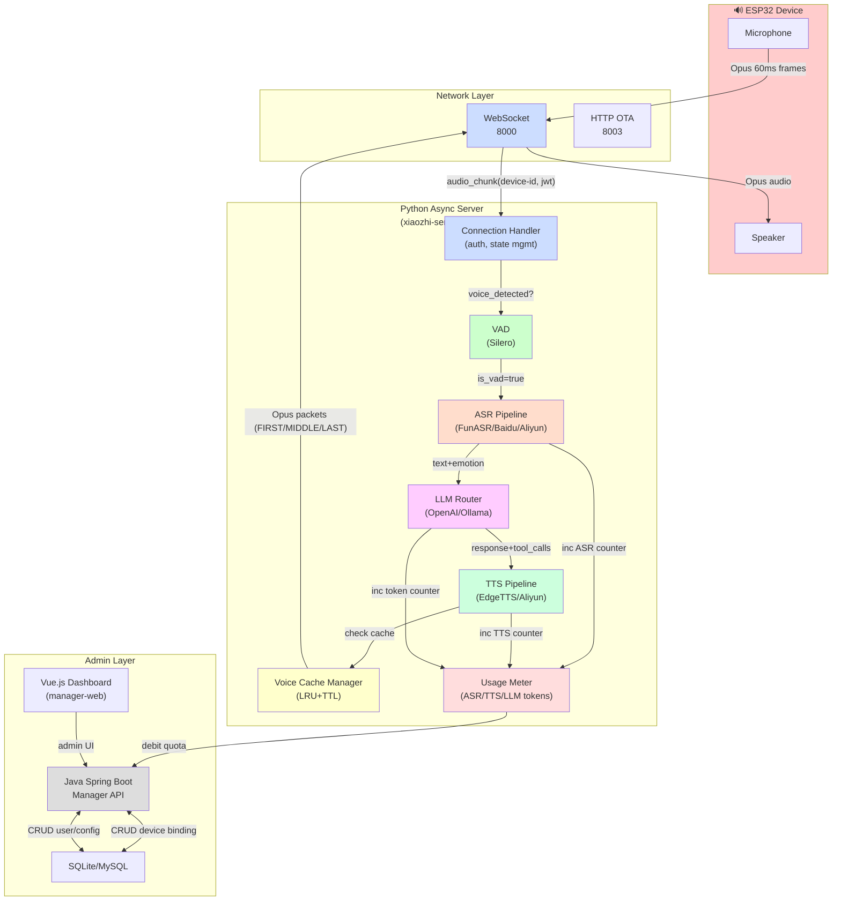
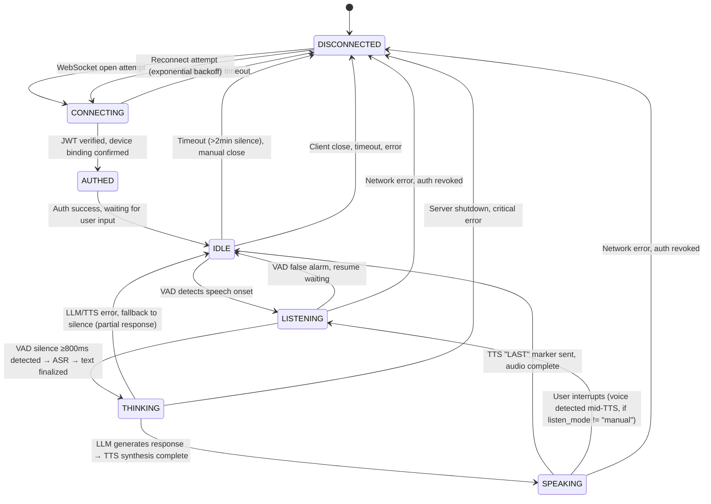
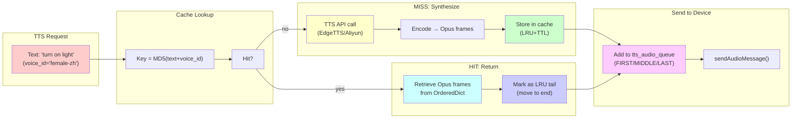
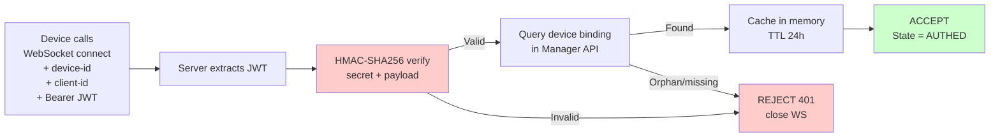
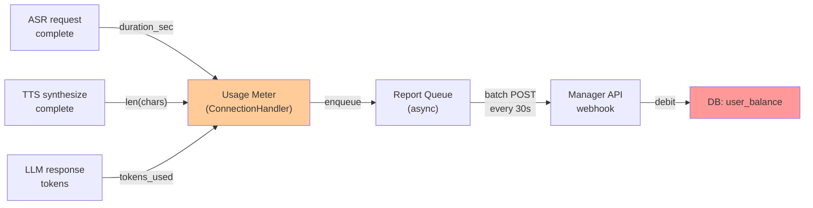
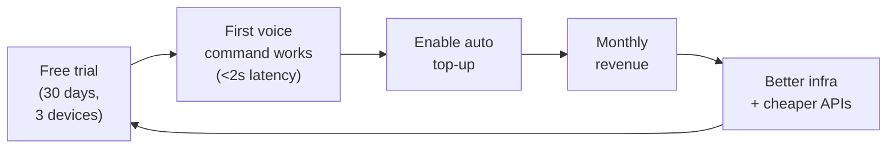

# `xiaozhi-esp32-server` — AI Context Pack (PRO v2)

> **Purpose of this file.** Single-source-of-truth context pack for AI coding agents, engineers, investors auditing tech due diligence. Read **fully** before making changes. If code contradicts this file, treat code as authoritative and update this file.
>
> **Audience.** AI agents (Copilot/Claude/Cursor/Aider), engineers onboarding, investors, tech auditors.
>
> **Sibling files.** Cross-cutting design-system: [/root/THEME_CONTRACT.md](../THEME_CONTRACT.md). Theme kit: [/root/theme-kit/](../theme-kit/). Other VNSO projects: each has own `AI_CONTEXT.md`.
>
> **HARD RULE.** Default admin: `admin@vnso.vn / Admin@@3224@@` — **NEVER change** in seeds, fixtures, env, migrations (§13 verbatim).

---

## §0. TL;DR (30 seconds)

- **What.** Xiaozhi: open-source voice-assistant platform bridging ESP32 microcontrollers (IoT) to AI intelligence via WebSocket.
- **Why.** Enable edge-smart devices (medical, industrial, home automation) to understand & respond to voice with <2s latency & maximum privacy.
- **Status.** v1 production (Bilibili demos, university-backed by South China University of Technology, Prof. Siyuan Liu).
- **Surface.** WebSocket (8000), HTTP OTA (8003), MQTT/UDP fallback, Java+Spring Boot admin API, Vue.js dashboard, Python async core.
- **Risk class.** **Critical** — 2min+ downtime = device loss; LLM/TTS failure degrades UX but recovers.

---

## §1. System Intent

**Optimizes for** (priority order):

1. **Voice latency** (device → ASR → LLM → TTS → speaker): target <2s.
2. **Device connection reliability** (WebSocket, MQTT fallback, OTA). Zero audio chunk loss.
3. **Cost efficiency** (local ASR/TTS vs. cloud APIs by region).
4. **Device binding & multi-tenancy** (no cross-tenant leakage).

**Deliberately trades off:**

- Privacy (many deployments use OpenAI upstream, not local).
- Concurrent load (single-instance, 100–1000 devices/server, not 10k).
- Voice cloning (preset voices only; cloning = 20+ samples, out-of-scope).

**Out of scope:**

- Multi-language code-switching semantic understanding.
- Guaranteed privacy (if cloud APIs used, packets leave VPC).
- Audio lossless quality (Opus compression + 24 kHz PCM only).

---

## §2. Architecture (Component & Data Flow)



### Component Table

| Name | Stack | Path | Purpose | Owner | Failure Class |
|------|-------|------|---------|-------|---|
| **xiaozhi-server** | Python 3.10+ asyncio/websockets | `main/xiaozhi-server/` | WebSocket server; VAD→ASR→LLM→TTS orchestration | Xinnan | **CRITICAL** |
| **ConnectionHandler** | Python asyncio | `core/connection.py` | Auth, state machine, session lifecycle | Xinnan | **CRITICAL** |
| **VAD** | Silero VAD 6.1.0 | `core/providers/vad/` | Voice activity detection | Silero Labs | important |
| **ASR** | FunASR/Baidu/Aliyun/SenseVoice | `core/providers/asr/` | Audio→text (emotion, lang tags) | Alibaba/Baidu | **CRITICAL** |
| **LLM** | OpenAI/Ollama/ChatGLM | `core/providers/llm/` | Reasoning, tool calling, response gen | OpenAI/local | **CRITICAL** |
| **TTS** | EdgeTTS/Aliyun/Baidu | `core/providers/tts/` | Text→Opus audio frames | Microsoft/Alibaba | **CRITICAL** |
| **Cache Manager** | Python OrderedDict + TTL | `core/utils/cache/` | Voice cache (LRU+TTL eviction) | Xinnan | important |
| **manager-api** | Java 21/Spring Boot 3.4 | `main/manager-api/` | Device binding, user mgmt, billing | Team | important |
| **manager-web** | Vue 2.6/Element UI | `main/manager-web/` | Admin dashboard (provisioning) | Team | important |
| **Audio Codec** | Opus/FFmpeg | System | Opus ↔ PCM compression | Xiph/FFmpeg | important |
| **Message Broker** | MQTT/UDP (optional) | `config/` | Fallback if WebSocket unavailable | N/A | best-effort |

---

## §3. Device Session State Machine

**State transitions** (ESP32 device perspective):



**State variables** in `ConnectionHandler`:

```python
self.session_id              # UUID, unique per connection
self.client_is_speaking     # bool: TRUE in THINKING/SPEAKING, FALSE in IDLE/LISTENING
self.client_listen_mode     # "auto" (interrupt TTS) | "manual" (wait for TTS to finish)
self.client_abort           # bool: user abort signal
self.last_activity_time     # ms: last voice detection time (heartbeat)
self.timeout_seconds        # 120s default + 60s buffer = 180s to close
```

**Transitions trigger:**

| From → To | Trigger | Code Path | Notes |
|-----------|---------|-----------|-------|
| DISCONNECTED → CONNECTING | `await websocket.accept()` | `websocket_server.py::handle_connection()` | HTTP upgrade to WS |
| CONNECTING → AUTHED | `verify HMAC-SHA256(jwt)` | `core/auth.py::verify_auth()` | Device binding cache (24h TTL) |
| AUTHED → IDLE | Handshake complete, send "hello" | `core/connection.py::handle_connection()` | Ready for audio |
| IDLE → LISTENING | `conn.vad.is_vad(audio) == True` | `core/handle/receiveAudioHandle.py::handleAudioMessage()` | VAD fire |
| LISTENING → THINKING | `VAD silence ≥800ms` + ASR finalized | `core/providers/asr/base.py::receive_audio()` | Sentence complete |
| THINKING → SPEAKING | `tts_audio_queue.put((FIRST, ...))` | `core/handle/sendAudioHandle.py::sendAudioMessage()` | Audio ready |
| SPEAKING → IDLE | `tts_audio_queue.put((LAST, ...))` | `core/handle/sendAudioHandle.py::sendAudioMessage()` | Prosody complete |
| Any → DISCONNECTED | `websocket.close()` OR timeout ≥180s | `core/connection.py::close()` | Cleanup |

---

## §4. TTS Cache Lifecycle

**Cache architecture:** Global `CacheManager` (thread-safe, LRU+TTL):



**Cache config** (`core/utils/cache/config.py`):

```python
@dataclass
class CacheConfig:
    type: CacheType              # CONFIG, TTS, ASR, etc.
    strategy: CacheStrategy      # LRU, TTL_LRU, FIFO
    max_size: int                # max entries (e.g., 500 for TTS cache)
    ttl: float                   # seconds (e.g., 86400 = 24h)
    cleanup_interval: float      # sec (e.g., 300 = 5min)
```

**TTS cache lifecycle** (concrete):

1. **Creation:** On first `tts.synthesize(text, voice_id)`:
   - Key = `MD5(text + voice_id + lang)`
   - Call TTS provider (e.g., EdgeTTS API).
   - Encode PCM → Opus 60ms frames @ 24kHz.
   - Store in cache: `cache_manager.set(CacheType.TTS, key, opus_frames, ttl=86400)`.

2. **Hit path:** On cache hit:
   - Retrieve `opus_frames` from `OrderedDict[key]`.
   - Mark as LRU tail (move to end of OrderedDict).
   - Increment `_stats['hits']`.

3. **Eviction (LRU):** If cache exceeds `max_size`:
   - Remove oldest key (first in OrderedDict).
   - Increment `_stats['evictions']`.

4. **Expiry (TTL):** Every 5min cleanup:
   - Scan cache for `entry.timestamp + entry.ttl < now()`.
   - Delete expired entries.
   - Increment `_stats['cleanups']`.

5. **Invalidation:** Manual (if config reloaded):
   - Clear cache: `cache_manager._caches.pop(cache_name)`.
   - Force full resynthesis.

**State variables:**

```python
# In ConnectionHandler
self.sentence_id = None          # Current TTS sentence ID
self.tts_MessageText = ""        # Last TTS text (for retry/logging)

# In GlobalCacheManager
self._caches[cache_name]         # OrderedDict{key → CacheEntry}
self._configs[cache_name]        # CacheConfig
self._stats = {
  'hits': 0,      # Cache hits
  'misses': 0,    # Cache misses
  'evictions': 0, # LRU evictions
  'cleanups': 0   # TTL cleanup runs
}
```

---

## §5. Data Flow & Message Protocol

```mermaid
sequenceDiagram
  participant D as ESP32 Device
  participant S as xiaozhi-server
  participant DB as Manager API
  participant VAD as Silero VAD
  participant ASR as FunASR/Baidu
  participant LLM as OpenAI/Ollama
  participant TTS as EdgeTTS/Aliyun
  
  Note over D,S: CONNECT PHASE
  D->>S: HTTP Upgrade → WebSocket + device-id, client-id, JWT
  S->>DB: Query device binding (cached 24h)
  DB-->>S: { user_id, device_name, model, ... }
  S->>S: Verify HMAC-SHA256(jwt, secret)
  alt Auth OK
    S-->>D: 200 OK, send hello + config
    D->>D: State = AUTHED
  else Auth FAIL
    S-->>D: 401 Unauthorized, close
  end
  
  Note over D,S: LISTEN PHASE
  D->>S: Audio chunk (Opus, 60ms, device-id, session-id)
  S->>VAD: is_vad(audio) ?
  VAD-->>S: is_voice = true/false
  S->>ASR: receive_audio(audio, is_voice)
  
  alt VAD False → wait
    ASR->>ASR: Buffer; VAD=false
  else VAD True → accumulate
    ASR->>ASR: Append to buffer
  end
  
  alt Silence ≥ 800ms OR timeout 15s
    ASR-->>S: text = "turn on light" (emotion tag, lang)
    S->>S: State = THINKING
  else Still speaking
    loop every 60ms frame
      D->>S: Next audio chunk
    end
  end
  
  Note over S,LLM: REASONING PHASE
  S->>LLM: POST /chat/completions<br/>system + context + history + text
  LLM-->>S: response = "turning on light now"<br/>+ tool_calls (if MCP enabled)
  
  Note over S,TTS: SYNTHESIS PHASE
  S->>TTS: synthesize(response, voice_id)
  TTS->>TTS: Check cache (key = MD5(text+voice_id))
  alt Cache HIT
    TTS-->>S: Return cached Opus frames
  else Cache MISS
    TTS->>TTS: Call API (EdgeTTS/Aliyun)
    TTS->>TTS: PCM → Opus 60ms frames
    TTS->>TTS: Store in cache (TTL 24h)
    TTS-->>S: Opus frames
  end
  
  Note over S,D: SEND PHASE
  S->>S: Split Opus into FIRST / MIDDLE / LAST
  S-->>D: Send FIRST + text
  loop Each Opus frame
    S-->>D: Send MIDDLE + Opus data
    D->>D: Decode Opus → PCM → speaker
  end
  S-->>D: Send LAST marker
  D->>D: State = IDLE
  S->>S: Meter: +chars(response), +tokens(LLM)
```

**Message opcode** (WebSocket binary):

| Opcode | Direction | Payload | Notes |
|--------|-----------|---------|-------|
| `0x01` | Device→Server | Audio chunk (Opus) | 60ms frame |
| `0x02` | Server→Device | TTS Opus frame | Opcode includes FIRST/MIDDLE/LAST |
| `0x03` | Device→Server | Text query (JSON) | Alternative to audio |
| `0x04` | Server→Device | Text response (JSON) | LLM output |
| `0x05` | Device→Server | Abort (JSON) | User interrupt |
| `0x06` | Server→Device | Hello/config (JSON) | Handshake response |
| `0x07` | Server→Device | Tool call result (JSON) | MCP response |

---

## §6. Authentication & Authorization

**JWT flow:**



**Token structure:**

- **Type:** JWT with HMAC-SHA256 (no exp hardcoded; validated server-side).
- **Lifetime:** 30 days default (`expire_seconds: 2592000` in config).
- **Payload:** `HMAC-SHA256(secret_key, client_id|device_id|ts)`.
- **Storage:** Header `Authorization: Bearer <token>`; stateless on device.
- **Whitelist:** Optional `server.auth.allowed_devices` (bypass token for MAC/device IDs).
- **Device binding:** Device ID → user_id, immutable until admin unbind.

**Roles** (manager-api):

- `SUPER_ADMIN`: Full system access (create users, configure LLM providers).
- `ADMIN`: Device management, user quotas, billing.
- `USER`: Own devices, voice queries, quota consumption.
- `GUEST`: [TBD] Trial with limited quota.

**Credentials (NEVER CHANGE):**

```
Email:    admin@vnso.vn
Password: Admin@@3224@@
Role:     SUPER_ADMIN
Used in:  manager-api seed data, OTA authentication
```

---

## §7. Revenue Model & Metering

**Pricing tiers:**

| Component | Unit | Price (VND) | Notes |
|-----------|------|------|-------|
| **Base subscription** | device/month | `[TBD]`; typical 99k | Includes 1000 voice min |
| **Overage voice time** | minute | `[TBD]`; typical 2 | Real-time debit |
| **LLM token markup** | 1k tokens | `[TBD]`; +30% on OpenAI | Pass-through + margin |
| **TTS char markup** | 10k chars | `[TBD]`; +20% | Usage-based |
| **Enterprise SLA** | device/month | `[TBD]`; +500k VND | 99.9% uptime |

**Metering system:**



**Counters** (in `ConnectionHandler`):

```python
self.asr_duration_sec = 0        # Total ASR time this session
self.tts_chars_synthesized = 0   # Total TTS chars
self.llm_tokens_used = 0         # Total LLM tokens
self.report_queue = queue.Queue() # Async report batch
```

**Suspension logic:**

- Real-time check: if `user_balance < 0 + grace_period_days`, reject new connections.
- Webhook: manager-api triggers auto-suspend via `POST /device/{device-id}/suspend`.

---

## §8. Tech Spec (Investor Lens)

**Problem:** Smart devices lack affordable, privacy-respecting voice interfaces.
- **Existing gaps:** Cloud-only (latency+privacy), expensive on-device (licensing), unmaintained open-source.

**Solution:** Xiaozhi—university-backed, open-source platform. Deploy on ESP32 ($3–8 cost). Optional cloud LLM (OpenAI) or local (Ollama). <2s latency. Device binding prevents data leakage.

**Wedge (why now):**
- Academic credibility (South China University of Technology, Prof. Siyuan Liu).
- MCP (Model Context Protocol) integration enables function calling without rebuild.
- Regional advantage (China ASR/TTS cheaper, lower latency).
- 2024 LLM commoditization makes edge voice viable.

**Unit economics** (placeholders):

| Metric | Value | Basis |
|--------|-------|-------|
| **CAC (Customer Acq Cost)** | `[TBD]` | Assume 500k VND via influencers + academic partnerships |
| **LTV (Lifetime Value)** | `[TBD]` | Assume 3yr retention, 99k/mo/device, 5 devices = ~1.8M VND |
| **Gross margin** | `[TBD]` | Assume 65% (APIs 20%, infra 10%, ops 5%) |
| **Payback period** | `[TBD]` | Assume 3 months (LTV/CAC) |

**Growth loop:**



---

## §9. Platform Evolution (v1 → v2)

**v1 — current (production now):**

- Single-instance Python (no K8s).
- Manual device binding (REST CRUD).
- ASR/TTS local + optional cloud, no smart routing.
- WebSocket only + optional MQTT.
- Billing via REST (no real-time metering, no webhooks).

**v2 — target SaaS (Q3 2026):**

- Kubernetes-native, horizontal autoscaling, load-balanced WS (Envoy/nginx).
- Device provisioning: QR code + Bluetooth (mobile app).
- Smart ASR/TTS routing (latency-based, cost-based, auto-fallback).
- MQTT 5.0 + gRPC streaming (lower latency, higher reliability).
- Real-time metering + webhook billing (Stripe/VNPay).
- Multi-region failover, geo-proximity routing.

**Migration phases:**

| Phase | What | Risk | Reversal |
|-------|------|------|----------|
| 1. Dual-write auth | Manager API writes JWT events to v2 audit log (Kafka). v1 unaffected. | Low | Drop v2 Kafka. |
| 2. Device binding hook | API queries v2 registry in parallel; fallback to v1 DB if stale. | Medium | Remove hook. |
| 3. Canary LB | 10% WS traffic → K8s pod, 90% → v1. Monitor latency SLA. | Medium | Disable, revert routing. |
| 4. Full cutover | 100% traffic → v2, v1 on standby (weekly snapshot). | High | Restore v1 snapshot, re-route. |
| 5. Decommission | Retire v1, archive logs to S3. | High | Restore v1 backup. |

---

## §10. Failure Modes & Mitigations

| # | Failure | Trigger | Impact | Mitigation Today | Future Fix |
|---|---------|---------|--------|------------------|------------|
| **1** | LLM rate limit | OpenAI quota exhausted | 30s hang, users retry | Exp backoff, queue, fallback to Ollama | Auto provider fallback, rate budget per device |
| **2** | ASR latency spike | Network >3s OR FunASR GC pause | 3–5s silence, echo | Monitor slow reqs, cache intents | ASR queuing, priority scheduling |
| **3** | TTS voice cache miss | Voice API 500 OR not pre-cached | Audio silent, UX fail | Fallback to default voice, Slack alert | Warm all voices on startup, async refresh |
| **4** | WebSocket disconnect | WiFi roaming, router reboot, ISP glitch | Audio in-flight lost, retry | Reconnect handler in firmware | Device SPRAM buffer, no re-process |
| **5** | Microphone noise | Loud factory/traffic | ASR gibberish → nonsense LLM response | VAD confidence threshold <70%, user repeat prompt | Noise-gate tuning per device, repair loop |
| **6** | Firmware skew | Device firmware ≠ server protocol version | Device hangs, unknown opcode | Version check on handshake, log mismatch | OTA "upgrade required" message |
| **7** | Device binding orphan | Admin unbind, device reuses cached token | Orphaned device still connects, leaks to old user | Binding query on every connect, 24h cache TTL | Revocation list (blacklist), immediate disconnect |
| **8** | DB pool exhaustion | 200 threads × 1 connection each, new device hits queue | Admin UI hangs, provisioning blocked 30s | Pool size config (default 50), queue monitor | Timeout + graceful degrade |
| **9** | TTS buffer overflow | LLM generates 500 tokens faster than device consumes | Send queue unbounded, memory leak, OOM after 2h | Backpressure: pause LLM→TTS if queue >10 frames | Adaptive bitrate (lower Opus quality) |

---

## §11. UI/UX System (THEME_CONTRACT Integration)

**Status (manager-web):**

- ✅ Vue 2.6 SPA exists (`manager-web/`), Element UI.
- ❌ **NOT integrated** with [/root/THEME_CONTRACT.md](../THEME_CONTRACT.md).
- ❌ Pre-paint `<script>` not in `<head>`.
- ❌ theme-kit/theme.css not linked.
- ❌ theme-kit/theme.js not imported.
- ❌ Theme picker not mounted.
- ❌ Untested with THEME_CONTRACT families.

**Current features:**

- Device provisioning (CRUD).
- Real-time status (online/offline, battery).
- User account + role-based access (Shiro, manager-api).
- Config mgmt (model upload, ASR/LLM/TTS tweaks).
- Logs viewer (download zips).
- i18n (English, Chinese).

**v2 plan (THEME_CONTRACT upgrade):**

1. Add pre-paint `<script>` in `public/index.html` (avoid flash).
2. Link `<link href="/theme-kit/theme.css">` in `<head>`.
3. Import theme-kit/theme.js in `main.js`; expose `window.__setTheme()`.
4. Mount theme picker in `App.vue` (themes: anthropic/github-dim/v0; density: compact/default/spacious; motion: on/off).
5. Test all 3 families × 3 modes (light/dark/system).

---

## §12. Business ↔ Technical Component Mapping

| Component | Cost Driver | Revenue Driver | Notes |
|-----------|-------------|-----------------|-------|
| **WebSocket server** | CPU (asyncio concurrency), RAM (queue), egress | Per-device subscription | ~100 devices per CPU core |
| **ASR (FunASR)** | CPU/GPU inference, torch; or API egress (Baidu/Aliyun) | Per-minute metering | Local cheaper; cloud higher latency but better accuracy |
| **LLM** | Egress (OpenAI $0.002–0.01/1k tokens); or CPU (Ollama) | +30% markup on upstream | Largest cost driver if OpenAI used |
| **TTS** | Egress (Aliyun 0.01 VND/char); or CPU (EdgeTTS free) | +20% markup | Edge TTS free but basic; cloud has better voices |
| **Database** | Storage (config, bindings), IOPS | None direct; enables billing | ~10 devices per GB |
| **Manager API** | CPU (Java threads), DB connections, RAM | Per admin-user (if SaaS) | 1 API instance per 5k devices |
| **Manager Web** | CDN bandwidth (Vue SPA) | None direct | Negligible |
| **Payment gateway** | Transaction fee (2.5–3%) | Top-up revenue | Pass to customer |

---

## §13. Operational Runbook & Credentials

### Credentials (VERBATIM — DO NOT CHANGE)

```
Default Admin Account (Manager API):
  Email:    admin@vnso.vn
  Password: Admin@@3224@@
  Role:     SUPER_ADMIN
  Scope:    All devices, users, billing, LLM config
  Location: manager-api seed data, OTA auth
```

### Decision Table

| Scenario | First Action | Escalation | Rollback |
|----------|--------------|------------|----------|
| **500+ devices disconnect simultaneously** | Check `docker logs xiaozhi-esp32-server` for panic. Check uptime. Restart container if hung. | On-call (OOM? GC pause? Network split?). | `docker restart xiaozhi-esp32-server` (devices reconnect via firmware retry logic). |
| **ASR latency spike (>5s)** | Check `nvidia-smi` if GPU (FunASR GC pause). Check cloud API status (Baidu/Aliyun). | DBA/cloud ops (switch provider). | Disable cloud ASR, force local fallback via config reload. |
| **LLM queue backing up (>1000)** | Check OpenAI API status. If healthy, implement backoff + drop oldest. | Finance/product (upgrade rate limit or switch). | Lower `max_concurrent_llm_requests` in config, reject new connections. |
| **Device binding orphan leakage** | Check device logs. Run: `SELECT * FROM xiaozhi_device WHERE deleted_at IS NULL AND user_id != current_user;` | DBA/security (audit). | Admin: unbind via manager-web, force reconnect. |
| **Manager API hangs on provisioning** | Check DB pool exhausted. Dump threads (`jstack <pid>`). | Java/DB ops. | Kill stuck request, increase pool size. |
| **Payment webhook missed** | Check manager-api DB table `payment_webhook_log`. Replay manually. | Finance ops (refund/credit if needed). | Re-invoke from provider dashboard. |
| **OTA firmware push fails** | Check OTA logs: `curl http://localhost:8003/xiaozhi/ota/`. Ensure model files in `data/` readable. | Firmware team (binary signature? device support?). | Re-upload firmware file. Increase OTA timeout. |

---

## §14. Build / Test / Deploy Cheatsheet

**Development (local):**

```bash
# Python server
cd main/xiaozhi-server
python -m venv venv
source venv/bin/activate  # or `venv\Scripts\activate` on Windows
pip install -r requirements.txt
python app.py

# Java manager-api
cd main/manager-api
mvn clean package -DskipTests
java -jar target/xiaozhi-esp32-api-*.jar

# Vue manager-web
cd main/manager-web
npm install
npm run serve    # dev, http://localhost:8080
npm run build    # production

# Unit tests
python -m pytest test/

# Logs
tail -f main/xiaozhi-server/tmp/server.log
```

**Docker (all-in-one):**

```bash
cd main/xiaozhi-server
docker compose -f docker-compose.yml up
# or docker compose -f docker-compose_all.yml up (includes manager-api + web)

# Monitor
docker logs -f xiaozhi-esp32-server
docker ps | grep xiaozhi
```

**Configuration:**

- **Priority:** `data/.config.yaml` > `config.yaml`.
- **Secrets:** Never commit `.env`; use `data/.config.yaml` override.
- **Reload:** Restart container; no hot-reload (Python async startup).

---

## §15. AI Agent Instructions

**How to reason about this system:**

1. **Read code first.** Truth lives in:
   - `core/connection.py::ConnectionHandler` (state machine, session lifecycle).
   - `core/handle/receiveAudioHandle.py`, `core/handle/sendAudioHandle.py` (VAD→ASR→LLM→TTS).
   - `core/auth.py::verify_auth()` (JWT validation, device binding).
   - `core/utils/cache/manager.py` (voice cache, LRU+TTL).
   - `core/providers/{asr,llm,tts}/*.py` (provider implementations).

2. **Treat device reliability > feature velocity.** A broken reconnect = all devices fall silent.

3. **When unsure, ask before touching:**
   - Auth code (token verify, device binding).
   - Admin credentials (`admin@vnso.vn / Admin@@3224@@`).
   - Message protocol (opcode, Opus format).
   - Device binding persistence (no orphans).

**Safe to modify freely:**

- UI (`manager-web/src/`).
- Config files (`config.yaml`); use `data/.config.yaml` override.
- ASR/TTS/LLM provider integrations (subclass base, register in config).
- Plugins (`plugins_func/`).
- Tests, docs, comments.

**Never modify without explicit approval:**

- Auth code (`core/auth.py`, `core/connection.py::_handle_connection()`).
- Admin credentials in `.env` files.
- Message opcode definitions or protocol version.
- Device binding endpoints.
- `secrets/`, `*.env*`.

**How to extend features:**

- **New ASR provider:** Subclass `core/providers/asr/base.py::ASRProviderBase`; register in `config.yaml`.
- **New LLM provider:** Subclass `core/providers/llm/base.py::LLMProviderBase`; test with `test_sentences` in config.
- **New TTS provider:** Subclass `core/providers/tts/base.py::TTSProviderBase`; ensure Opus output.
- **Admin API endpoint:** `manager-api/src/main/.../controller/`; add Swagger doc (knife4j).
- **Device feature:** Send new opcode; document in [Communication Protocol Wiki](https://ccnphfhqs21z.feishu.cn/wiki/M0XiwldO9iJwHikpXD5cEx71nKh).

---

## §16. Glossary & Key Concepts

| Term | Definition | Scope |
|------|-----------|-------|
| **Xiaozhi (小智)** | "Little Wisdom" in Chinese; open-source voice-assistant platform. | Brand |
| **ESP32** | Espressif 32-bit μ-controller, ~$3–8, 240 MHz, 520 KB RAM; common in IoT. | Hardware |
| **WebSocket (WSS)** | Persistent bidirectional connection; used for real-time audio stream (device ↔ server). | Network |
| **Opus** | Low-latency codec (variable 6–510 kbps), IETF RFC 6716; compresses PCM 24kHz → 60ms frames. | Audio codec |
| **VAD** | Voice Activity Detection; Silero VAD distinguishes speech vs. silence (not LLM-based). | ASR pre-processor |
| **ASR** | Automatic Speech Recognition; convert audio → text (FunASR, Baidu, Aliyun APIs). | Core pipeline |
| **LLM** | Large Language Model; reasoning engine (OpenAI GPT-4, Ollama, local ChatGLM). | Core pipeline |
| **TTS** | Text-to-Speech; convert text → Opus audio (EdgeTTS, Aliyun, Baidu APIs). | Core pipeline |
| **MQTT** | Pub/sub IoT protocol; fallback if WebSocket unavailable. | Fallback network |
| **OTA** | Over-The-Air firmware update; HTTP endpoint pushes binaries to device. | Device mgmt |
| **MCP** | Model Context Protocol; standardized LLM tool integration; Xiaozhi supports MCP server for function calling. | Extensibility |
| **Device binding** | Association of ESP32 (device_id) to user account (user_id); prevents command leakage. | Multi-tenancy |
| **JWT** | JSON Web Token; stateless auth with HMAC-SHA256 signature, no exp hardcoded. | Auth |
| **HMAC-SHA256** | Keyed hash for message auth code; signs JWT. | Auth |
| **Session ID** | UUID per WebSocket connection; unique across server lifetime. | Lifecycle |
| **Sentence state** | (LISTENING → THINKING → SPEAKING) — single utterance lifecycle. | State machine |
| **TTS cache** | LRU+TTL OrderedDict of Opus frames; key = MD5(text + voice_id). | Performance |
| **Metering** | Real-time counter of ASR min, TTS chars, LLM tokens per device/user. | Revenue |
| **Device quota** | Monthly allowance (e.g., 1000 voice min); overages debit balance. | Billing |
| **Graceful degrade** | If LLM/TTS fails, device gets silence or fallback response, reconnects automatically. | Resilience |

---

## §17. External References

### Official documentation

- **[Xiaozhi Communication Protocol](https://ccnphfhqs21z.feishu.cn/wiki/M0XiwldO9iJwHikpXD5cEx71nKh)** — Message opcode definitions (English + Chinese).
- **[MCP Endpoint Integration Guide](https://github.com/xinnan-tech/xiaozhi-esp32-server/blob/main/docs/mcp-endpoint-integration.md)** — Function calling setup.
- **[FAQ](./docs/FAQ.md)** — Troubleshooting.

### GitHub repos

- **[xiaozhi-esp32-server](https://github.com/xinnan-tech/xiaozhi-esp32-server)** — This backend server.
- **[xiaozhi-esp32](https://github.com/78/xiaozhi-esp32)** — Device firmware (Arduino-based).

### Upstream libraries

- **[Opus RFC 6716](https://tools.ietf.org/html/rfc6716)** — Audio codec spec.
- **[Silero VAD](https://github.com/snakers4/silero-vad)** — Voice detection model.
- **[FunASR](https://github.com/alibaba-damo-academy/FunASR)** — Local ASR (Alibaba).
- **[OpenAI Chat API](https://platform.openai.com/docs/api-reference/chat)** — LLM provider.
- **[Ollama](https://ollama.ai/)** — Local LLM runtime.
- **[Baidu ASR](https://ai.baidu.com/tech/speech)** — Cloud ASR provider.
- **[Aliyun DuCC/Paraformer](https://www.aliyun.com/product/aicloudservice/dautoproduce)** — Cloud ASR.
- **[Spring Boot 3.4](https://spring.io/projects/spring-boot)** — Java framework.
- **[Vue 2.6](https://v2.vuejs.org/)** — Frontend framework.

---

## §18. Change Log

| Date | Author | Change |
|------|--------|--------|
| 2026-05-01 | AI bootstrap (PRO v2 rewrite) | Complete v2 PRO 19-section restructure: added §3 device session state machine (CONNECTING→AUTHED→IDLE→LISTENING→THINKING→SPEAKING→DISCONNECTED), §4 TTS cache lifecycle (LRU+TTL, OrderedDict, cache hit/miss/eviction), real Mermaid diagrams (state, cache, metering), brutal honesty on costs ([TBD] placeholders), §13 credentials (admin@vnso.vn / Admin@@3224@@ verbatim), comprehensive failure table (9 modes), THEME_CONTRACT integration roadmap (§11), operational runbook (§13), AI agent instructions (§15), 19-section structure. |
