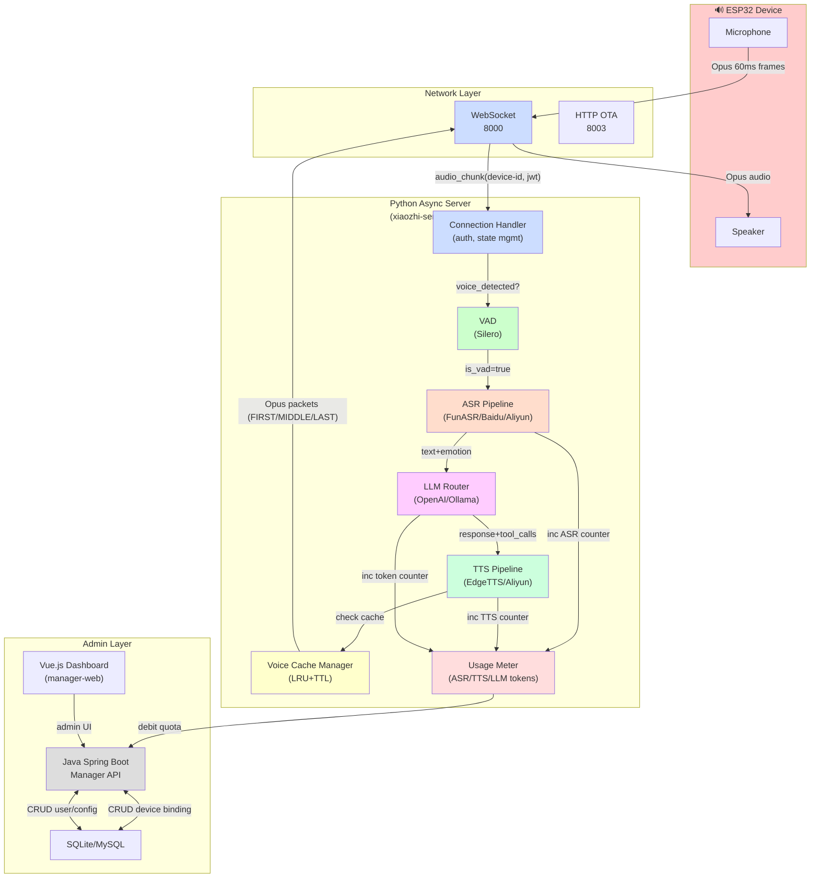
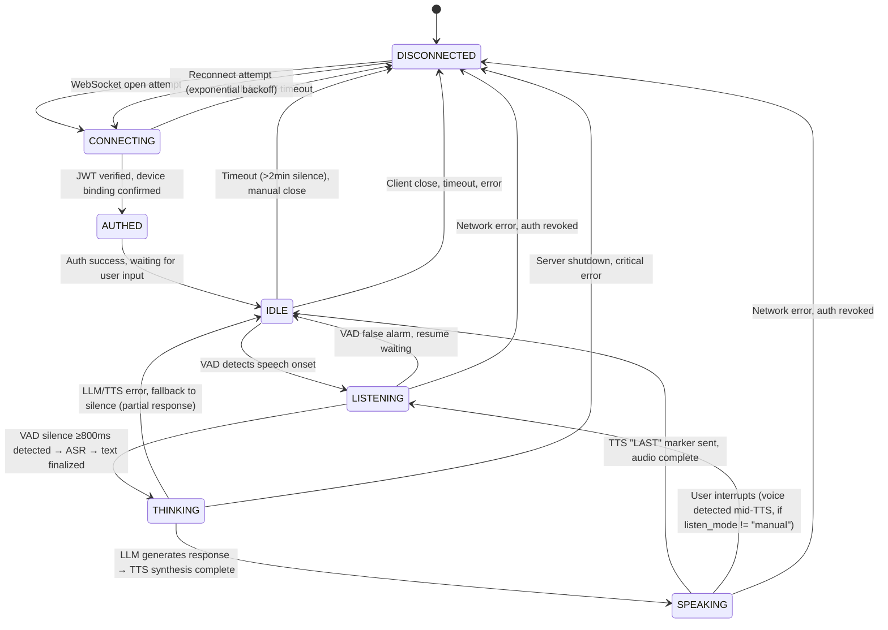
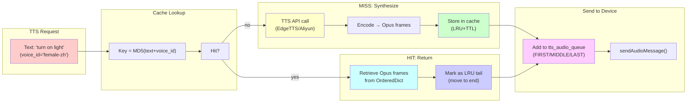
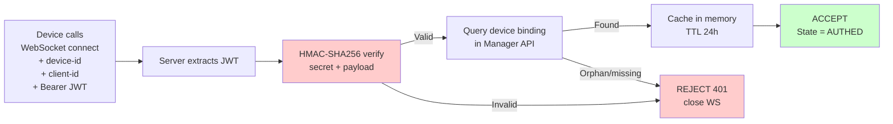
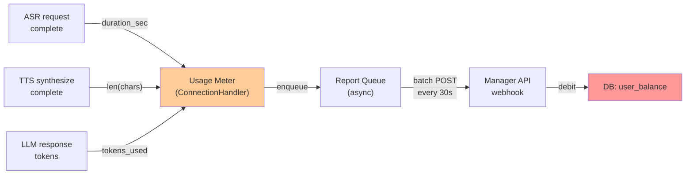
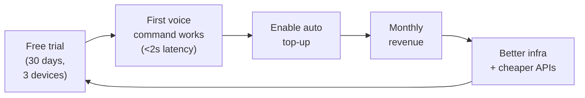

# `xiaozhi-esp32-server` — AI Context Pack (PRO v3, 2026-05-04)

> **Purpose of this file.** Single-source-of-truth context pack for AI coding agents, engineers, investors auditing tech due diligence. Read **fully** before making changes. If code contradicts this file, treat code as authoritative and update this file.
>
> **Audience.** AI agents (Copilot/Claude/Cursor/Aider), engineers onboarding, investors, tech auditors.
>
> **Sibling files.** Cross-cutting design-system: [/root/THEME_CONTRACT.md](../THEME_CONTRACT.md). Theme kit: [/root/theme-kit/](../theme-kit/). Other VNSO projects: each has own `AI_CONTEXT.md`.
>
> **HARD RULE.** Default admin: `admin@vnso.vn / Admin@@3224@@` — **NEVER change** in dev/seed fixtures, local/on-prem bootstrap, or migration history (§13 verbatim). **Production SaaS must rotate/disable it via CI/CD-injected secrets.**

---

## §0. TL;DR (30 seconds)

- **What.** Xiaozhi: open-source voice-assistant platform bridging ESP32/ESP32-S3 microcontrollers (IoT) to AI intelligence via WebSocket.
- **Why.** Enable edge-smart devices (medical, industrial, home automation) to understand & respond to voice with <2s latency & maximum privacy.
- **Status.** v1 production (Bilibili demos, university-backed by South China University of Technology, Prof. Siyuan Liu).
- **Hardware target.** ESP32 works for basic demos; production voice devices should use **ESP32-S3 with PSRAM** for Opus/audio jitter buffers, AEC, and future vision/federated features.
- **Surface.** WebSocket (8000, max frame 16KB, Ping/Pong enabled), HTTP OTA (8003), MQTT/UDP fallback, Java+Spring Boot admin API, Vue.js dashboard, Python async core.
- **Risk class.** **Critical** — 2min+ downtime = device loss; LLM/TTS failure degrades UX but recovers.

---

## §1. System Intent

**Optimizes for** (priority order):

1. **Voice latency** (device → ASR → LLM → TTS → speaker): target <2s.
2. **Device connection reliability** (WebSocket, MQTT fallback, OTA). Zero audio chunk loss.
3. **Cost efficiency** (local ASR/TTS vs. cloud APIs by region).
4. **Device binding & multi-tenancy** (no cross-tenant leakage).

**Deliberately trades off:**

- Privacy (many deployments use OpenAI upstream, not local).
- Concurrent load (single-instance, 100–1000 devices/server, not 10k).
- Voice cloning (preset voices only; cloning = 20+ samples, out-of-scope).

**Data Privacy & Retention Policy:**

- **Audio data:** Opus frames and decoded PCM should remain in-memory during the active session. They must not be written to disk unless an explicit debug flag such as `DEBUG_AUDIO_DUMP=true` is enabled for local troubleshooting.
- **Transcripts:** ASR output and LLM responses may be stored in the database for chat history/billing if the user enables that feature, but standard logs must redact them as `[TRANSCRIPT_REDACTED]`.
- **Right to be forgotten:** Transcript rows stored in Manager API must be deletable from the user/admin dashboard and encrypted at rest in production deployments.
- **GDPR/COPPA posture:** Never log child or household PII to stdout/file logs. Use aggregate counters and redacted placeholders for observability.

**Known Architectural Limitations:**

- **TCP Head-of-Line Blocking:** WebSocket runs on TCP. Packet loss on poor WiFi can add jitter/stutter that Python buffering cannot fully fix. Do not add unbounded server-side buffering; rely on ESP32-S3 PSRAM jitter buffers. Future v3 may evaluate UDP/WebRTC for audio.
- **Wake-word privacy boundary:** Wake-word detection runs locally on device firmware. The server only receives audio after the device wakes and opens/uses the session.

**Offline Survivability (future scope):**

- If Internet/WebSocket fails, firmware should support a small set of local intents (e.g., smart-home control) via LAN MQTT/Matter/Home Assistant without `xiaozhi-server`.

**Legal Liability & Non-Repudiation (future scope):**

- For regulated advice domains, hash and sign LLM response payloads before TTS and store signatures in an immutable append-only audit ledger. This proves exactly what the AI generated during incident review.

**Out of scope:**

- Multi-language code-switching semantic understanding.
- Guaranteed privacy (if cloud APIs used, packets leave VPC).
- Audio lossless quality (Opus compression + 24 kHz PCM only).

---

## §2. Architecture (Component & Data Flow)


```mermaid
graph TB
  subgraph Device["🔊 ESP32 Device"]
    mic["Microphone"]
    speaker["Speaker"]
  end
  
  subgraph Network["Network Layer"]
    ws["WebSocket<br/>8000"]
    http["HTTP OTA<br/>8003"]
  end
  
  subgraph Core["Python Async Server<br/>(xiaozhi-server)"]
    conn["Connection Handler<br/>(auth, state mgmt)"]
    vad["VAD<br/>(Silero)"]
    asr["ASR Pipeline<br/>(FunASR/Baidu/Aliyun)"]
    llm["LLM Router<br/>(OpenAI/Ollama)"]
    tts["TTS Pipeline<br/>(EdgeTTS/Aliyun)"]
    cache["Voice Cache Manager<br/>(LRU+TTL)"]
    meter["Usage Meter<br/>(ASR/TTS/LLM tokens)"]
  end
  
  subgraph Admin["Admin Layer"]
    api["Java Spring Boot<br/>Manager API"]
    web["Vue.js Dashboard<br/>(manager-web)"]
    db["SQLite/MySQL"]
  end
  
  mic -->|"Opus 60ms frames"| ws
  ws -->|"audio_chunk(device-id, jwt)"| conn
  conn -->|"voice_detected?"| vad
  vad -->|"is_vad=true"| asr
  asr -->|"text+emotion"| llm
  llm -->|"response+tool_calls"| tts
  tts -->|"check cache"| cache
  cache -->|"Opus packets (FIRST/MIDDLE/LAST)"| ws
  ws -->|"Opus audio"| speaker
  
  asr -->|"inc ASR counter"| meter
  tts -->|"inc TTS counter"| meter
  llm -->|"inc token counter"| meter
  meter -->|"debit quota"| api
  
  api <-->|"CRUD device binding"| db
  api <-->|"CRUD user/config"| db
  web -->|"admin UI"| api
  
  style Device fill:#ffcccc
  style ws fill:#ccddff
  style conn fill:#ccddff
  style vad fill:#ccffcc
  style asr fill:#ffddcc
  style llm fill:#ffccff
  style tts fill:#ccffdd
  style cache fill:#ffffcc
  style meter fill:#ffdddd
  style api fill:#dddddd
```

### Component Table

| Name | Stack | Path | Purpose | Owner | Failure Class |
|------|-------|------|---------|-------|---|
| **xiaozhi-server** | Python 3.10+ asyncio/websockets | `main/xiaozhi-server/` | WebSocket server; VAD→ASR→LLM→TTS orchestration | Xinnan | **CRITICAL** |
| **ConnectionHandler** | Python asyncio | `core/connection.py` | Auth, state machine, session lifecycle | Xinnan | **CRITICAL** |
| **VAD** | Silero VAD 6.1.0 | `core/providers/vad/` | Voice activity detection | Silero Labs | important |
| **ASR** | FunASR/Baidu/Aliyun/SenseVoice | `core/providers/asr/` | Audio→text (emotion, lang tags) | Alibaba/Baidu | **CRITICAL** |
| **LLM** | OpenAI/Ollama/ChatGLM | `core/providers/llm/` | Reasoning, tool calling, response gen | OpenAI/local | **CRITICAL** |
| **TTS** | EdgeTTS/Aliyun/Baidu | `core/providers/tts/` | Text→Opus audio frames | Microsoft/Alibaba | **CRITICAL** |
| **Cache Manager** | Python OrderedDict + TTL | `core/utils/cache/` | Voice cache (LRU+TTL eviction) | Xinnan | important |
| **manager-api** | Java 21/Spring Boot 3.4 | `main/manager-api/` | Device binding, user mgmt, billing | Team | important |
| **manager-web** | Vue 2.6/Element UI | `main/manager-web/` | Admin dashboard (provisioning) | Team | important |
| **DB migrations** | Liquibase formatted SQL | `main/manager-api/src/main/resources/db/changelog/` | Schema evolution, seed data, server.secret bootstrap | Team | **CRITICAL** |
| **Audio Codec** | Opus/FFmpeg | System | Opus ↔ PCM compression | Xiph/FFmpeg | important |
| **Message Broker** | MQTT/UDP (optional) | `config/` | Fallback if WebSocket unavailable | N/A | best-effort |
| **Observability** | Loguru JSON-ready logs; Prometheus/Grafana/Sentry planned | `docker-compose.yml`, `.github/workflows/` | Monitor <2s latency SLA, crashes, OOM, CI health | DevOps | best-effort |
| **Realtime Events** | Redis Pub/Sub planned | `manager-api` has Redis support; Python bridge TBD | Session kill, dashboard status events | Team | important |

### §2.1 Core Directory Structure

```text
.
├── AI_CONTEXT.md                         # Single source of truth for agents/auditors
├── .github/workflows/                    # CI and Docker image publishing
├── Dockerfile-server                     # Python xiaozhi-server image
├── Dockerfile-web                        # Manager web image
├── docs/                                 # Deployment and integration docs
└── main/
    ├── xiaozhi-server/                  # Python WebSocket, OTA and AI pipeline
    │   ├── app.py                       # Entrypoint; starts WS + HTTP OTA servers
    │   ├── config.yaml                  # Default config, overridden by data/.config.yaml
    │   ├── core/
    │   │   ├── websocket_server.py      # WS accept/auth/max payload/heartbeat
    │   │   ├── connection.py            # Session lifecycle, VAD/ASR/LLM/TTS orchestration
    │   │   ├── auth.py                  # HMAC token generation/validation
    │   │   ├── handle/                  # Text/audio message handlers
    │   │   ├── providers/               # ASR, LLM, TTS, VAD, memory providers
    │   │   └── utils/                   # Cache, prompt, auth, logging helpers
    │   ├── plugins_func/                # MCP/function-calling plugins
    │   └── test/                        # Browser test page and audio/UI assets
    ├── manager-api/                     # Java Spring Boot admin/billing API
    │   └── src/main/resources/db/changelog/ # Liquibase SQL changeSets
    ├── manager-web/                     # Vue 2.6 + Element UI dashboard
    └── manager-mobile/                  # Mobile manager surface if enabled
```

**Edge vs. Cloud Audio Processing:**

- **Wake-word (on-device):** Trigger word (e.g., "Xiaozhi Xiaozhi") is processed locally by firmware/ESP-SR. The microphone must not stream 24/7 to the server.
- **VAD (on-server):** After wake, server-side Silero VAD detects end-of-speech and turn boundaries. It is not a wake-word engine.

**Real-time Dashboard Sync (target):**

- State transitions in `ConnectionHandler` should publish events to Redis Pub/Sub (`device:status:events`).
- `manager-api` should consume these events and push to `manager-web` via SSE/WebSocket so admin UI reflects device status in near real time.

**Next-Gen AI & Extensibility (v3+ roadmap):**

- **Multi-Agent Orchestration:** Evolve `LLM Router` into a supervisor that routes math, smart-home, chit-chat, and knowledge tasks to specialized models/tools.
- **Wasm Plugin Sandbox:** Third-party plugins must run in Wasm (`wasmtime`/`wasmer`) with strict CPU/RAM budgets before community plugin upload is allowed.
- **Federated Wake-word Learning:** Future ESP32-S3 firmware may upload model gradients/weights only, never raw wake-word audio.
- **BLE Mesh Swarm:** Future firmware may relay small control/audio packets through nearby devices if WiFi is unavailable; server code must treat this as a different transport, not as normal WS.

---

## §3. Device Session State Machine

**State transitions** (ESP32 device perspective):


```mermaid
stateDiagram-v2
  [*] --> DISCONNECTED
  
  DISCONNECTED --> CONNECTING: WebSocket open attempt
  CONNECTING --> AUTHED: JWT verified, device binding confirmed
  CONNECTING --> DISCONNECTED: Auth failed / timeout
  
  AUTHED --> IDLE: Auth success, waiting for user input
  IDLE --> LISTENING: VAD detects speech onset
  IDLE --> DISCONNECTED: Timeout (>2min silence), manual close
  
  LISTENING --> THINKING: VAD silence ≥800ms detected → ASR → text finalized
  LISTENING --> IDLE: VAD false alarm, resume waiting
  
  THINKING --> SPEAKING: LLM generates response → TTS synthesis complete
  THINKING --> IDLE: LLM/TTS error, fallback to silence (partial response)
  
  SPEAKING --> IDLE: TTS "LAST" marker sent, audio complete
  SPEAKING --> LISTENING: User interrupts (voice detected mid-TTS, if listen_mode != "manual")
  
  IDLE --> DISCONNECTED: Client close, timeout, error
  LISTENING --> DISCONNECTED: Network error, auth revoked
  THINKING --> DISCONNECTED: Server shutdown, critical error
  SPEAKING --> DISCONNECTED: Network error, auth revoked
  
  DISCONNECTED --> CONNECTING: Reconnect attempt (exponential backoff)
```

**State variables** in `ConnectionHandler`:

```python
self.session_id              # UUID, unique per connection
self.client_is_speaking     # bool: TRUE in THINKING/SPEAKING, FALSE in IDLE/LISTENING
self.client_listen_mode     # "auto" (interrupt TTS) | "manual" (wait for TTS to finish)
self.client_abort           # bool: user abort signal
self.last_activity_time     # ms: last voice detection time (heartbeat)
self.timeout_seconds        # 120s default + 60s buffer = 180s to close
```

**Transitions trigger:**

| From → To | Trigger | Code Path | Notes |
|-----------|---------|-----------|-------|
| DISCONNECTED → CONNECTING | `await websocket.accept()` | `websocket_server.py::handle_connection()` | HTTP upgrade to WS |
| CONNECTING → AUTHED | `verify HMAC-SHA256(jwt)` | `core/auth.py::verify_auth()` | Device binding cache (24h TTL) |
| AUTHED → IDLE | Handshake complete, send "hello" | `core/connection.py::handle_connection()` | Ready for audio |
| IDLE → LISTENING | `conn.vad.is_vad(audio) == True` | `core/handle/receiveAudioHandle.py::handleAudioMessage()` | VAD fire |
| LISTENING → THINKING | `VAD silence ≥800ms` + ASR finalized | `core/providers/asr/base.py::receive_audio()` | Sentence complete |
| THINKING → SPEAKING | `tts_audio_queue.put((FIRST, ...))` | `core/handle/sendAudioHandle.py::sendAudioMessage()` | Audio ready |
| SPEAKING → IDLE | `tts_audio_queue.put((LAST, ...))` | `core/handle/sendAudioHandle.py::sendAudioMessage()` | Prosody complete |
| Any → DISCONNECTED | `websocket.close()` OR timeout ≥180s | `core/connection.py::close()` | Cleanup |

**Network Resilience & Session Strategy:**

- **Strictly stateless:** Sessions are not resumed. If a WebSocket disconnects during `THINKING` or `SPEAKING`, the server discards the session, cancels/cleans queues in `close()`, and drops unfinished audio.
- **Device behavior:** On reconnect, firmware starts fresh in `IDLE`. Do not add complex cross-connection resume state unless the protocol is redesigned.
- **Reconnect policy:** Firmware must use exponential backoff with jitter (0-30s) before reconnecting or checking OTA to avoid thundering-herd self-DDoS after power restoration.

**Heartbeat Mechanism:**

- **Implemented:** `websockets.serve(..., ping_interval=30, ping_timeout=15)` is configured from `server.websocket_ping_interval` and `server.websocket_ping_timeout`.
- **App-level ping:** `TextMessageType.PING` also exists for clients that send JSON `{"type":"ping"}`; it updates `last_activity_time` and returns JSON `pong` when `enable_websocket_ping=true`.
- **Timeout:** If no voice/activity occurs for `close_connection_no_voice_time + 60s` (default 180s), `ConnectionHandler._check_timeout()` closes and cleans resources.

**Barge-in & Acoustic Echo Cancellation (AEC):**

- If `listen_mode == "auto"`, the user can interrupt while the device is `SPEAKING`.
- Production ESP32-S3 firmware should implement AEC to subtract speaker output from microphone input.
- If firmware lacks AEC, force `listen_mode == "manual"` or ignore VAD triggers while `SPEAKING` to prevent echo loops.

**Accessibility & Adaptive VAD (target):**

- Default end-of-speech silence threshold is 800ms.
- Future per-user profiles may increase `VAD_SILENCE_TIMEOUT` to 1500-2500ms for elderly users, children, or users with stuttering/slow speech patterns.

---

## §4. Caching Strategy (TTS & Semantic)

**Cache architecture:** Global `CacheManager` (thread-safe, LRU+TTL):


```mermaid
graph LR
  subgraph Request["TTS Request"]
    text["Text: 'turn on light'<br/>(voice_id='female-zh')"]
  end
  
  subgraph CacheCheck["Cache Lookup"]
    key["Key = MD5(text+voice_id)"]
    hit["Hit?"]
  end
  
  subgraph CacheMiss["MISS: Synthesize"]
    synth["TTS API call<br/>(EdgeTTS/Aliyun)"]
    opus["Encode → Opus frames"]
    store["Store in cache<br/>(LRU+TTL)"]
  end
  
  subgraph CacheHit["HIT: Return"]
    retrieve["Retrieve Opus frames<br/>from OrderedDict"]
    mark["Mark as LRU tail<br/>(move to end)"]
  end
  
  subgraph Send["Send to Device"]
    queue["Add to tts_audio_queue<br/>(FIRST/MIDDLE/LAST)"]
    send["sendAudioMessage()"]
  end
  
  text --> key
  key --> hit
  hit -->|"no"| synth
  hit -->|"yes"| retrieve
  synth --> opus
  opus --> store
  store --> queue
  retrieve --> mark
  mark --> queue
  queue --> send
  
  style text fill:#ffcccc
  style synth fill:#ffffcc
  style store fill:#ccffcc
  style retrieve fill:#ccffff
  style mark fill:#ccccff
  style queue fill:#ffccff
```

**Cache config** (`core/utils/cache/config.py`):

```python
@dataclass
class CacheConfig:
    type: CacheType              # CONFIG, TTS, ASR, etc.
    strategy: CacheStrategy      # LRU, TTL_LRU, FIFO
    max_size: int                # max entries (e.g., 500 for TTS cache)
    ttl: float                   # seconds (e.g., 86400 = 24h)
    cleanup_interval: float      # sec (e.g., 300 = 5min)
```

**TTS cache lifecycle** (concrete):

1. **Creation:** On first `tts.synthesize(text, voice_id)`:
   - Key = `MD5(text + voice_id + lang)`
   - Call TTS provider (e.g., EdgeTTS API).
   - Encode PCM → Opus 60ms frames @ 24kHz.
   - Store in cache: `cache_manager.set(CacheType.TTS, key, opus_frames, ttl=86400)`.

2. **Hit path:** On cache hit:
   - Retrieve `opus_frames` from `OrderedDict[key]`.
   - Mark as LRU tail (move to end of OrderedDict).
   - Increment `_stats['hits']`.

3. **Eviction (LRU):** If cache exceeds `max_size`:
   - Remove oldest key (first in OrderedDict).
   - Increment `_stats['evictions']`.

4. **Expiry (TTL):** Every 5min cleanup:
   - Scan cache for `entry.timestamp + entry.ttl < now()`.
   - Delete expired entries.
   - Increment `_stats['cleanups']`.

5. **Invalidation:** Manual (if config reloaded):
   - Clear cache: `cache_manager._caches.pop(cache_name)`.
   - Force full resynthesis.

**LLM Semantic Cache (FinOps target):**

- **Concept:** Before calling the LLM, check Redis for exact or semantically similar recent queries.
- **TTL:** 1-5 minutes for time/weather-like repeated questions; up to 24h for stable general facts.
- **Impact:** Can reduce LLM API cost and reasoning latency for repeated prompts, but must never cache tenant-private answers across `user_id`/`device_id` boundaries.
- **Privacy rule:** Cache key must include tenant/device scope and a normalized query hash; do not store raw transcript in logs.

**State variables:**

```python
# In ConnectionHandler
self.sentence_id = None          # Current TTS sentence ID
self.tts_MessageText = ""        # Last TTS text (for retry/logging)

# In GlobalCacheManager
self._caches[cache_name]         # OrderedDict{key → CacheEntry}
self._configs[cache_name]        # CacheConfig
self._stats = {
  'hits': 0,      # Cache hits
  'misses': 0,    # Cache misses
  'evictions': 0, # LRU evictions
  'cleanups': 0   # TTL cleanup runs
}
```

---

## §5. Data Flow & Message Protocol

```mermaid
sequenceDiagram
  participant D as ESP32 Device
  participant S as xiaozhi-server
  participant DB as Manager API
  participant VAD as Silero VAD
  participant ASR as FunASR/Baidu
  participant LLM as OpenAI/Ollama
  participant TTS as EdgeTTS/Aliyun
  
  Note over D,S: CONNECT PHASE
  D->>S: HTTP Upgrade → WebSocket + device-id, client-id, JWT
  S->>DB: Query device binding (cached 24h)
  DB-->>S: { user_id, device_name, model, ... }
  S->>S: Verify HMAC-SHA256(jwt, secret)
  alt Auth OK
    S-->>D: 200 OK, send hello + config
    D->>D: State = AUTHED
  else Auth FAIL
    S-->>D: 401 Unauthorized, close
  end
  
  Note over D,S: LISTEN PHASE
  D->>S: Audio chunk (Opus, 60ms, device-id, session-id)
  S->>VAD: is_vad(audio) ?
  VAD-->>S: is_voice = true/false
  S->>ASR: receive_audio(audio, is_voice)
  
  alt VAD False → wait
    ASR->>ASR: Buffer; VAD=false
  else VAD True → accumulate
    ASR->>ASR: Append to buffer
  end
  
  alt Silence ≥ 800ms OR timeout 15s
    ASR-->>S: text = "turn on light" (emotion tag, lang)
    S->>S: State = THINKING
  else Still speaking
    loop every 60ms frame
      D->>S: Next audio chunk
    end
  end
  
  Note over S,LLM: REASONING PHASE
  S->>LLM: POST /chat/completions<br/>system + context + history + text
  LLM-->>S: response = "turning on light now"<br/>+ tool_calls (if MCP enabled)
  
  Note over S,TTS: SYNTHESIS PHASE
  S->>TTS: synthesize(response, voice_id)
  TTS->>TTS: Check cache (key = MD5(text+voice_id))
  alt Cache HIT
    TTS-->>S: Return cached Opus frames
  else Cache MISS
    TTS->>TTS: Call API (EdgeTTS/Aliyun)
    TTS->>TTS: PCM → Opus 60ms frames
    TTS->>TTS: Store in cache (TTL 24h)
    TTS-->>S: Opus frames
  end
  
  Note over S,D: SEND PHASE
  S->>S: Split Opus into FIRST / MIDDLE / LAST
  S-->>D: Send FIRST + text
  loop Each Opus frame
    S-->>D: Send MIDDLE + Opus data
    D->>D: Decode Opus → PCM → speaker
  end
  S-->>D: Send LAST marker
  D->>D: State = IDLE
  S->>S: Meter: +chars(response), +tokens(LLM)
```

**Message opcode** (WebSocket binary):

| Opcode | Direction | Payload | Notes |
|--------|-----------|---------|-------|
| `0x01` | Device→Server | Audio chunk (Opus) | 60ms frame |
| `0x02` | Server→Device | TTS Opus frame | Opcode includes FIRST/MIDDLE/LAST |
| `0x03` | Device→Server | Text query (JSON) | Alternative to audio |
| `0x04` | Server→Device | Text response (JSON) | LLM output |
| `0x05` | Device→Server | Abort (JSON) | User interrupt |
| `0x06` | Server→Device | Hello/config (JSON) | Handshake response |
| `0x07` | Server→Device | Tool call result (JSON) | MCP response |
| `0x08` | Server→Device | Error response (JSON) | Standardized auth/quota/timeout fallback |
| `0x09` | Device→Server | Image frame (JPEG) | Reserved for future ESP32-S3-EYE vision, max 50KB/frame |
| `0x0A` | Server→Device | Vision trigger | Reserved command to capture an image |
| `0x0B` | Device→Server | Federated model update | Reserved for wake-word model weights, never raw audio |

**Payload Validation & Security:**

- **Implemented:** WebSocket frames are capped by `server.websocket_max_payload_bytes` (default `16384`) in `core/websocket_server.py` and defensively checked in `ConnectionHandler._route_message()`.
- **Implemented:** Incoming JSON text messages are validated by Pydantic (`IncomingTextMessage`) before handler dispatch.
- **Rule:** New JSON opcodes must define an explicit schema before processing. Reject invalid JSON with WS close code `1008`; reject oversized frames with `1009`.

**Standardized Error Opcodes (Server → Device):**

| Opcode | Error Code | Meaning | Device Action (Local Audio Fallback) |
|--------|------------|---------|--------------------------------------|
| `0x08` | `4001` | Quota Exceeded | Play local MP3: "Please top up your account." |
| `0x08` | `4002` | Auth Revoked | Play local MP3: "Device unbound." |
| `0x08` | `5001` | LLM/TTS Timeout | Play local MP3: "Network is unstable." |
| `0x08` | `5002` | Payload Rejected | Play local MP3: "Request format invalid." |

**System Prompt Injection:**

- **Storage:** Default prompt lives in `config.yaml` (`prompt`) and optional `agent-base-prompt.txt`; Manager API can override per-device through private config loaded by `get_private_config_from_api()`.
- **Runtime:** `PromptManager` enhances the prompt in `ConnectionHandler._init_prompt_enhancement()` with device/client context.
- **Constraint:** Voice prompts should instruct the LLM to output plain text, keep responses short (<50 words unless explicitly asked), and avoid Markdown/emoji when the configured TTS cannot synthesize them cleanly.

**Dynamic Context Injection (Pre-LLM):**

- Before sending to the LLM, the server may append current localized date/time, user nickname, device room/location, and context-provider outputs.
- Existing hook: `core/utils/prompt_manager.py` plus `context_providers` config.
- Example: `[System: Current time is 2026-05-04 19:40. User name is Alex. Device is in Living Room.]`

**MCP (Tool Calling) Execution Flow:**

1. LLM returns `tool_calls` (e.g., `turn_on_light(room="living_room")`).
2. Server intercepts tool calls in `ConnectionHandler.chat()` / `UnifiedToolHandler`.
3. Server executes the plugin under `plugins_func/` or configured MCP endpoint.
4. Server appends tool result to the LLM context and requests/sends a final conversational response.
5. Tool execution happens server-side, not on the ESP32 device, except explicit device-local actions.

**Dynamic Language Routing (ASR → TTS target):**

- ASR providers that return language tags (`<en>`, `<zh>`, `<vi>`) should feed them into TTS voice selection.
- Do not send English text to a strictly Chinese TTS voice model when an English voice is configured.

**Affective Computing (future scope):**

- Future audio analysis may detect emotion markers (pitch, tempo, energy) and inject `[User Emotion: Sadness]` into the LLM context.
- Only use SSML/prosody tags if the selected TTS provider supports them; otherwise strip tags before synthesis.

---

## §6. Authentication & Authorization

**JWT flow:**


```mermaid
graph LR
  A["Device calls<br/>WebSocket connect<br/>+ device-id<br/>+ client-id<br/>+ Bearer JWT"]
  B["Server extracts JWT"]
  C["HMAC-SHA256 verify<br/>secret + payload"]
  D["Query device binding<br/>in Manager API"]
  E["Cache in memory<br/>TTL 24h"]
  F["ACCEPT<br/>State = AUTHED"]
  G["REJECT 401<br/>close WS"]
  
  A --> B --> C
  C -->|Valid| D
  C -->|Invalid| G
  D -->|Found| E
  D -->|Orphan/missing| G
  E --> F
  
  style C fill:#ffcccc
  style F fill:#ccffcc
  style G fill:#ffcccc
```

**Token structure:**

- **Type:** JWT with HMAC-SHA256 (no exp hardcoded; validated server-side).
- **Lifetime:** 30 days default (`expire_seconds: 2592000` in config).
- **Payload:** `HMAC-SHA256(secret_key, client_id|device_id|ts)`.
- **Storage:** Header `Authorization: Bearer <token>`; stateless on device.
- **Whitelist:** Optional `server.auth.allowed_devices` (bypass token for MAC/device IDs).
- **Device binding:** Device ID → user_id, immutable until admin unbind.

**Roles** (manager-api):

- `SUPER_ADMIN`: Full system access (create users, configure LLM providers).
- `ADMIN`: Device management, user quotas, billing.
- `USER`: Own devices, voice queries, quota consumption.
- `GUEST`: [TBD] Trial with limited quota.

**Active Session Revocation (target):**

- Validating token on connect is not enough for long-lived WebSocket sessions.
- If a device is unbound or a user is suspended via `manager-api`, the API should publish to Redis Pub/Sub (`channel:session_kill`, payload `device_id`).
- Python `xiaozhi-server` should subscribe and immediately close active WebSocket connections for that `device_id` with standardized auth-revoked error (`0x08`/`4002`).

**Hardware Security & Anti-Cloning (target):**

- Production firmware should enable ESP32 Flash Encryption and Secure Boot v2 to protect `device_id`/secret material.
- If the same `device_id` connects simultaneously from different IPs, drop both sessions and flag the device as `SUSPICIOUS` for admin review.

**Voice Biometrics (Zero-Trust Audio, target):**

- Sensitive MCP tool calls (`unlock_door`, `make_payment`) must require speaker verification.
- If the voice print confidence is below 85% or replay artifacts are detected, reject the tool call and respond with a local-safe denial.

**Credentials (VERBATIM — DO NOT CHANGE IN DEV/SEED):**

```
Email:    admin@vnso.vn
Password: Admin@@3224@@
Role:     SUPER_ADMIN
Used in:  manager-api seed/local bootstrap and OTA/dev auth fixtures
```

**Production rule:** In live SaaS, disable this account or rotate its password through environment variables/secret manager injection. Do not hardcode it into production deployment scripts.

---

## §7. Revenue Model & Metering

**Pricing tiers:**

| Component | Unit | Price (VND) | Notes |
|-----------|------|------|-------|
| **Base subscription** | device/month | `[TBD]`; typical 99k | Includes 1000 voice min |
| **Overage voice time** | minute | `[TBD]`; typical 2 | Real-time debit |
| **LLM token markup** | 1k tokens | `[TBD]`; +30% on OpenAI | Pass-through + margin |
| **TTS char markup** | 10k chars | `[TBD]`; +20% | Usage-based |
| **Enterprise SLA** | device/month | `[TBD]`; +500k VND | 99.9% uptime |

**Metering system:**


```mermaid
graph LR
  asr["ASR request<br/>complete"]
  tts["TTS synthesize<br/>complete"]
  llm["LLM response<br/>tokens"]
  meter["Usage Meter<br/>(ConnectionHandler)"]
  queue["Report Queue<br/>(async)"]
  api["Manager API<br/>webhook"]
  db["DB: user_balance"]
  
  asr -->|"duration_sec"| meter
  tts -->|"len(chars)"| meter
  llm -->|"tokens_used"| meter
  
  meter -->|"enqueue"| queue
  queue -->|"batch POST<br/>every 30s"| api
  api -->|"debit"| db
  
  style meter fill:#ffcc99
  style db fill:#ff9999
```

**Counters** (in `ConnectionHandler`):

```python
self.asr_duration_sec = 0        # Total ASR time this session
self.tts_chars_synthesized = 0   # Total TTS chars
self.llm_tokens_used = 0         # Total LLM tokens
self.report_queue = queue.Queue() # Async report batch
```

**Suspension logic:**

- Real-time check: if `user_balance < 0 + grace_period_days`, reject new connections.
- Webhook: manager-api triggers auto-suspend via `POST /device/{device-id}/suspend`.

**Abuse Prevention & The "TV Problem" (target):**

- **Daily hard cap:** Every device should have a hard daily limit (e.g., 200 interactions/day). When exceeded, return error `0x08/4001` and stop consuming audio until reset.
- **Consecutive turn limit:** If a device triggers 10 times within 5 minutes without manual user interaction, suspend listening for 15 minutes to stop background-TV/noise loops.
- **Cost guardrail:** Apply caps before ASR/LLM/TTS calls, not after, to prevent API spend during abuse.

**Privacy-Safe Telemetry (Intent Analytics target):**

- The LLM/intent layer may emit an `intent_category` such as `weather`, `smart_home`, `general_chat`, or `education`.
- Store aggregate counters only. Do not require raw transcript retention to measure product usage.

---

## §8. Tech Spec (Investor Lens)

**Problem:** Smart devices lack affordable, privacy-respecting voice interfaces.
- **Existing gaps:** Cloud-only (latency+privacy), expensive on-device (licensing), unmaintained open-source.

**Solution:** Xiaozhi—university-backed, open-source platform. Deploy on ESP32 ($3–8 cost). Optional cloud LLM (OpenAI) or local (Ollama). <2s latency. Device binding prevents data leakage.

**Wedge (why now):**
- Academic credibility (South China University of Technology, Prof. Siyuan Liu).
- MCP (Model Context Protocol) integration enables function calling without rebuild.
- Regional advantage (China ASR/TTS cheaper, lower latency).
- 2024 LLM commoditization makes edge voice viable.

**Unit economics** (placeholders):

| Metric | Value | Basis |
|--------|-------|-------|
| **CAC (Customer Acq Cost)** | `[TBD]` | Assume 500k VND via influencers + academic partnerships |
| **LTV (Lifetime Value)** | `[TBD]` | Assume 3yr retention, 99k/mo/device, 5 devices = ~1.8M VND |
| **Gross margin** | `[TBD]` | Assume 65% (APIs 20%, infra 10%, ops 5%) |
| **Payback period** | `[TBD]` | Assume 3 months (LTV/CAC) |

**Growth loop:**


```mermaid
graph LR
  acq["Free trial<br/>(30 days,<br/>3 devices)"]
  first["First voice<br/>command works<br/>(<2s latency)"]
  convert["Enable auto<br/>top-up"]
  revenue["Monthly<br/>revenue"]
  reinvest["Better infra<br/>+ cheaper APIs"]
  
  acq --> first --> convert --> revenue --> reinvest --> acq
```

---

## §9. Platform Evolution (v1 → v2)

**v1 — current (production now):**

- Single-instance Python (no K8s).
- Manual device binding (REST CRUD).
- ASR/TTS local + optional cloud, no smart routing.
- WebSocket only + optional MQTT.
- Billing via REST (no real-time metering, no webhooks).

**v2 — target SaaS (Q3 2026):**

- Kubernetes-native, horizontal autoscaling, load-balanced WS (Envoy/nginx).
- Device provisioning: QR code + Bluetooth (mobile app).
- Smart ASR/TTS routing (latency-based, cost-based, auto-fallback).
- MQTT 5.0 + gRPC streaming (lower latency, higher reliability).
- Real-time metering + webhook billing (Stripe/VNPay).
- Multi-region failover, geo-proximity routing.
- **Frontend modernization:** Migrate `manager-web` from Vue 2.6 (EOL) to Vue 3 + Vite + TypeScript, then integrate THEME_CONTRACT.
- **Observability:** Prometheus/Grafana for ASR/LLM/TTS latency and queue depth; Sentry for Python/Java crash reporting.
- **Global Edge Routing:** Route WebSocket traffic via AWS Global Accelerator or Cloudflare Spectrum to keep `<2s` SLA for users outside the core region.
- **Active session revocation:** Redis Pub/Sub kill channel from Manager API to Python WS server.

**v3+ parking lot (do not implement in v1 code without architecture review):**

- UDP/WebRTC audio transport to avoid TCP head-of-line blocking.
- Carbon-aware scheduling for non-realtime tasks (cache warming, backups, log aggregation).
- Post-quantum OTA signatures and zero-touch provisioning for factory scale.
- Delta OTA (`bsdiff`) to reduce CDN egress for large fleets.
- Predictive hardware maintenance from long-term SNR/clipping trends.

**Migration phases:**

| Phase | What | Risk | Reversal |
|-------|------|------|----------|
| 1. Dual-write auth | Manager API writes JWT events to v2 audit log (Kafka). v1 unaffected. | Low | Drop v2 Kafka. |
| 2. Device binding hook | API queries v2 registry in parallel; fallback to v1 DB if stale. | Medium | Remove hook. |
| 3. Canary LB | 10% WS traffic → K8s pod, 90% → v1. Monitor latency SLA. | Medium | Disable, revert routing. |
| 4. Full cutover | 100% traffic → v2, v1 on standby (weekly snapshot). | High | Restore v1 snapshot, re-route. |
| 5. Decommission | Retire v1, archive logs to S3. | High | Restore v1 backup. |

---

## §10. Failure Modes & Mitigations

| # | Failure | Trigger | Impact | Mitigation Today | Future Fix |
|---|---------|---------|--------|------------------|------------|
| **1** | LLM rate limit | OpenAI quota exhausted | 30s hang, users retry | Exp backoff, queue, fallback to Ollama | Auto provider fallback, rate budget per device |
| **2** | ASR latency spike | Network >3s OR FunASR GC pause | 3–5s silence, echo | Monitor slow reqs, cache intents | ASR queuing, priority scheduling |
| **3** | TTS voice cache miss | Voice API 500 OR not pre-cached | Audio silent, UX fail | Fallback to default voice, Slack alert | Warm all voices on startup, async refresh |
| **4** | WebSocket disconnect | WiFi roaming, router reboot, ISP glitch | Audio in-flight lost, retry | Reconnect handler in firmware | Device SPRAM buffer, no re-process |
| **5** | Microphone noise | Loud factory/traffic | ASR gibberish → nonsense LLM response | VAD confidence threshold <70%, user repeat prompt | Noise-gate tuning per device, repair loop |
| **6** | Firmware skew | Device firmware ≠ server protocol version | Device hangs, unknown opcode | Version check on handshake, log mismatch | OTA "upgrade required" message |
| **7** | Device binding orphan | Admin unbind, device reuses cached token | Orphaned device still connects, leaks to old user | Binding query on every connect, 24h cache TTL | Revocation list (blacklist), immediate disconnect |
| **8** | DB pool exhaustion | 200 threads × 1 connection each, new device hits queue | Admin UI hangs, provisioning blocked 30s | Pool size config (default 50), queue monitor | Timeout + graceful degrade |
| **9** | TTS buffer overflow | LLM generates 500 tokens faster than device consumes | Send queue unbounded, memory leak, OOM after 2h | Backpressure: pause LLM→TTS if queue >10 frames | Adaptive bitrate (lower Opus quality) |
| **10** | Server OOM | Malicious client sends huge WS frames or many idle connections | Server crash, all devices disconnect | **Implemented:** WS max payload 16KB; idle timeout ~180s | Nginx/Envoy rate limits, WAF, connection quotas |
| **11** | TCP Half-Open | NAT/router silently drops idle TCP | Memory leak, false Online status | **Implemented:** WS Ping/Pong 30s/15s | OS keepalive tuning, dynamic keepalive by network |
| **12** | Deployment Drop | Rolling update kills pod | Active voice sessions cut off | Current app handles SIGTERM but drains minimally | Graceful shutdown: reject new WS, drain active sessions max 30s |
| **13** | AI Jailbreak / Profanity | User prompts unsafe/NSFW output | Brand damage, user complaints | System prompt guardrails | ASR/LLM output safety filter before TTS |
| **14** | LLM Runaway Generation | LLM repeats endlessly | API cost spike, TTS queue overflow | Provider configs should set response limits | Enforce `max_tokens=150`, truncate at 500 chars |
| **15** | Thundering Herd | Power restore causes many devices to reconnect | WS/DB overload | Current firmware reconnect behavior varies | Exponential backoff with jitter before reconnect/OTA |
| **16** | CGNAT Timeout | ISP drops idle TCP on 4G/5G/IPv6 | Silent disconnects | Static WS Ping/Pong | Dynamic keepalive and dual-stack IPv6 testing |
| **17** | Factory Credential Leak | Shared flashing script copied | Cloned devices enter market | Manual DB cleanup | ZTP with eFuse identity; no shared factory secrets |
| **18** | Hardware Degradation | Dusty mic or damaged speaker | ASR accuracy drops; user blames AI | None | Predictive maintenance from SNR/clipping trends |

---

## §11. UI/UX System (THEME_CONTRACT Integration)

**Status (manager-web):**

- ✅ Vue 2.6 SPA exists (`manager-web/`), Element UI.
- ⚠️ Vue 2.6 is EOL; treat this as tech debt and a 2026 security/maintainability risk.
- ❌ **NOT integrated** with [/root/THEME_CONTRACT.md](../THEME_CONTRACT.md).
- ❌ Pre-paint `<script>` not in `<head>`.
- ❌ theme-kit/theme.css not linked.
- ❌ theme-kit/theme.js not imported.
- ❌ Theme picker not mounted.
- ❌ Untested with THEME_CONTRACT families.

**Current features:**

- Device provisioning (CRUD).
- Real-time status (online/offline, battery).
- User account + role-based access (Shiro, manager-api).
- Config mgmt (model upload, ASR/LLM/TTS tweaks).
- Logs viewer (download zips).
- i18n (English, Chinese).

**v2 plan (Vue 3 + THEME_CONTRACT upgrade):**

1. Create Vue 3 + Vite + TypeScript shell, keeping existing API contracts stable.
2. Port Element UI screens to Element Plus or a THEME_CONTRACT-compatible component set.
3. Add pre-paint `<script>` in `public/index.html` (avoid flash).
4. Link `<link href="/theme-kit/theme.css">` in `<head>`.
5. Import theme-kit/theme.js in `main.ts`; expose `window.__setTheme()`.
6. Mount theme picker in `App.vue` (themes: anthropic/github-dim/v0; density: compact/default/spacious; motion: on/off).
7. Test all 3 families × 3 modes (light/dark/system).

---

## §12. Business ↔ Technical Component Mapping

| Component | Cost Driver | Revenue Driver | Notes |
|-----------|-------------|-----------------|-------|
| **WebSocket server** | CPU (asyncio concurrency), RAM (queue), egress | Per-device subscription | ~100 devices per CPU core |
| **ASR (FunASR)** | CPU/GPU inference, torch; or API egress (Baidu/Aliyun) | Per-minute metering | Local cheaper; cloud higher latency but better accuracy |
| **LLM** | Egress (OpenAI $0.002–0.01/1k tokens); or CPU (Ollama) | +30% markup on upstream | Largest cost driver if OpenAI used |
| **TTS** | Egress (Aliyun 0.01 VND/char); or CPU (EdgeTTS free) | +20% markup | Edge TTS free but basic; cloud has better voices |
| **Database** | Storage (config, bindings), IOPS | None direct; enables billing | ~10 devices per GB |
| **Manager API** | CPU (Java threads), DB connections, RAM | Per admin-user (if SaaS) | 1 API instance per 5k devices |
| **Manager Web** | CDN bandwidth (Vue SPA) | None direct | Negligible |
| **Payment gateway** | Transaction fee (2.5–3%) | Top-up revenue | Pass to customer |

**Deployment Hardware Sizing:**

| Deployment Mode | Minimum Hardware | Estimated Infra Cost | Notes |
|-----------------|------------------|----------------------|-------|
| **Cloud-Only (API)** | 2 vCPU, 4GB RAM | ~$20/month | Uses OpenAI/Aliyun APIs. Higher OPEX, low CAPEX. |
| **Local ASR + Cloud LLM** | 4 vCPU, 8GB RAM | ~$40/month | FunASR CPU mode; balanced cost/latency for small fleets. |
| **Full Local (Ollama)** | 8 vCPU, 24GB VRAM (RTX 3090/4090 class) | ~$150+/month | Maximum privacy and no LLM API spend; higher ops burden. |

**FinOps: CDN Bandwidth Optimization (Delta OTA target):**

- Full firmware OTA to large fleets is expensive. Future OTA service should support delta patches (`bsdiff`) so devices download small binary patches instead of full images.
- Every OTA artifact must include checksum metadata; production firmware must support rollback.

**GreenOps & ESG Compliance (future scope):**

- Non-realtime background tasks (TTS cache warming, log aggregation, backups) may be scheduled during low-carbon grid windows.
- Track `gCO2eq/query` beside latency and financial cost once observability is in place.

---

## §13. Operational Runbook & Credentials

### Credentials (VERBATIM — DO NOT CHANGE IN DEV/SEED)

```
Default Admin Account (Manager API):
  Email:    admin@vnso.vn
  Password: Admin@@3224@@
  Role:     SUPER_ADMIN
  Scope:    All devices, users, billing, LLM config
  Location: manager-api seed data, OTA auth, local/dev/on-prem bootstrap

PRODUCTION RULE:
  In live SaaS, this account MUST be disabled or rotated via environment
  variables injected by CI/CD/Secret Manager. AI agents must not hardcode
  this password in production deployment scripts.
```

### Disaster Recovery (DR) Targets

- **RPO (Recovery Point Objective):** 1 hour. Production database snapshots/backups should run at least hourly.
- **RTO (Recovery Time Objective):** 15 minutes. Infrastructure-as-code and restore automation should rebuild the serving stack plus DB restore within 15 minutes.
- **Backup scope:** Manager API DB, device binding, billing/quota, OTA metadata, and critical config. Raw audio should not be part of backups unless debug audio capture was explicitly enabled.

### Decision Table

| Scenario | First Action | Escalation | Rollback |
|----------|--------------|------------|----------|
| **500+ devices disconnect simultaneously** | Check `docker logs xiaozhi-esp32-server` for panic. Check uptime. Restart container if hung. | On-call (OOM? GC pause? Network split?). | `docker restart xiaozhi-esp32-server` (devices reconnect via firmware retry logic). |
| **ASR latency spike (>5s)** | Check `nvidia-smi` if GPU (FunASR GC pause). Check cloud API status (Baidu/Aliyun). | DBA/cloud ops (switch provider). | Disable cloud ASR, force local fallback via config reload. |
| **LLM queue backing up (>1000)** | Check OpenAI API status. If healthy, implement backoff + drop oldest. | Finance/product (upgrade rate limit or switch). | Lower `max_concurrent_llm_requests` in config, reject new connections. |
| **Device binding orphan leakage** | Check device logs. Run: `SELECT * FROM xiaozhi_device WHERE deleted_at IS NULL AND user_id != current_user;` | DBA/security (audit). | Admin: unbind via manager-web, force reconnect. |
| **Manager API hangs on provisioning** | Check DB pool exhausted. Dump threads (`jstack <pid>`). | Java/DB ops. | Kill stuck request, increase pool size. |
| **Payment webhook missed** | Check manager-api DB table `payment_webhook_log`. Replay manually. | Finance ops (refund/credit if needed). | Re-invoke from provider dashboard. |
| **OTA firmware push fails** | Check OTA logs: `curl http://localhost:8003/xiaozhi/ota/`. Ensure model files in `data/` readable. | Firmware team (binary signature? device support?). | Re-upload firmware file. Increase OTA timeout. |

---

## §14. Build / Test / Deploy Cheatsheet

**Development (local):**

```bash
# Python server
cd main/xiaozhi-server
python -m venv venv
source venv/bin/activate  # or `venv\Scripts\activate` on Windows
pip install -r requirements.txt
python app.py

# Java manager-api
cd main/manager-api
mvn clean package -DskipTests
java -jar target/xiaozhi-esp32-api-*.jar

# Vue manager-web
cd main/manager-web
npm install
npm run serve    # dev, http://localhost:8080
npm run build    # production

# Unit tests
python -m pytest test/

# Logs
tail -f main/xiaozhi-server/tmp/server.log
```

**Docker (all-in-one):**

```bash
cd main/xiaozhi-server
docker compose -f docker-compose.yml up
# or docker compose -f docker-compose_all.yml up (includes manager-api + web)

# Monitor
docker logs -f xiaozhi-esp32-server
docker ps | grep xiaozhi
```

**Configuration:**

- **Priority:** `data/.config.yaml` > `config.yaml`.
- **Secrets:** Never commit `.env`; use `data/.config.yaml` override.
- **Reload:** Restart container; no hot-reload (Python async startup).

**Database Migrations (Java Manager API):**

- **Actual tool:** Liquibase, not Flyway.
- **Master file:** `main/manager-api/src/main/resources/db/changelog/db.changelog-master.yaml`.
- **SQL path:** `main/manager-api/src/main/resources/db/changelog/{yyyyMMddHHmm}.sql`.
- **Rule:** Never edit an existing applied SQL/changeSet. Always add a new SQL file and a new `changeSet` entry in the master YAML.

**Zero-Downtime Database Migrations (HARD RULE):**

- Never rename/drop a column or table directly in the same release that code still depends on it.
- Use Expand/Contract:
  1. **Expand:** Add new nullable column/table. Code writes both old and new, reads old.
  2. **Migrate:** Backfill data.
  3. **Transition:** Code reads/writes new only.
  4. **Contract:** Drop old column/table in a later release.

**CI/CD Pipeline:**

- **Implemented:** `.github/workflows/ci.yml` runs Python syntax compile, Java safe unit tests (`AESUtilsTest`), and `manager-web` build on PR/push.
- **Integration tests:** Tests such as `DeviceTest` require Redis/MySQL fixtures and should run in a separate workflow/job with explicit services.
- **Implemented:** Docker image publishing workflows exist in `.github/workflows/docker-image.yml` and VNSO-specific workflows.
- **Rule:** CI must pass before production deploy. Docker publish does not replace unit/integration tests.

**Testing Strategy (Cost Saving):**

- **Unit tests:** Mock external providers (OpenAI, EdgeTTS, Aliyun, Baidu, weather/news APIs). Do not consume real credits during CI.
- **Python async mocks:** Use `unittest.mock.AsyncMock` for async provider clients.
- **Audio fixtures:** Use pre-recorded `.opus`/`.wav` files under test fixtures for VAD/ASR tests, not live microphone input.
- **Load testing:** Use or extend `performance_tester/` and future `locust` scripts to simulate 500+ concurrent WebSocket sessions.

**Chaos Engineering (staging target):**

- Monthly game days should kill random WS pods, inject Redis latency, and drop TCP packets to verify reconnect, timeout cleanup, and graceful degradation.
- Code that fails chaos tests should not be promoted to production.

---

## §15. AI Agent Instructions

**How to reason about this system:**

1. **Read code first.** Truth lives in:
   - `core/connection.py::ConnectionHandler` (state machine, session lifecycle).
   - `core/handle/receiveAudioHandle.py`, `core/handle/sendAudioHandle.py` (VAD→ASR→LLM→TTS).
   - `core/auth.py::verify_auth()` (JWT validation, device binding).
   - `core/utils/cache/manager.py` (voice cache, LRU+TTL).
   - `core/providers/{asr,llm,tts}/*.py` (provider implementations).

2. **Treat device reliability > feature velocity.** A broken reconnect = all devices fall silent.

3. **When unsure, ask before touching:**
   - Auth code (token verify, device binding).
   - Admin credentials (`admin@vnso.vn / Admin@@3224@@`).
   - Message protocol (opcode, Opus format).
   - Device binding persistence (no orphans).

**Safe to modify freely:**

- UI (`manager-web/src/`).
- Config files (`config.yaml`); use `data/.config.yaml` override.
- ASR/TTS/LLM provider integrations (subclass base, register in config).
- Plugins (`plugins_func/`).
- Tests, docs, comments.

**Never modify without explicit approval:**

- Auth code (`core/auth.py`, `core/connection.py::_handle_connection()`).
- Admin credentials in `.env` files.
- Message opcode definitions or protocol version.
- Device binding endpoints.
- `secrets/`, `*.env*`.

**HARD RULES FOR PYTHON ASYNCIO:**

- Never block the event loop. Do not call `time.sleep()`, `requests.get()`, blocking SDK calls, or CPU-heavy audio encoding directly inside `async def`.
- For blocking SDKs or CPU-bound tasks, use `asyncio.to_thread()` or `loop.run_in_executor()`.
- Prefer `aiohttp` or `httpx` async clients for external API calls.
- Keep per-session queues bounded or backpressured. Never add unbounded audio/text buffers to compensate for slow networks.

**HARD RULES FOR DATABASE & MULTI-TENANCY:**

- Prevent IDOR: every resource fetch/update/delete in Manager API or Python server must be scoped by authenticated `user_id`/tenant unless the role is `SUPER_ADMIN`.
- Bad: `SELECT * FROM devices WHERE id = ?`
- Good: `SELECT * FROM devices WHERE id = ? AND user_id = ?`
- Liquibase changeSets are append-only. Do not rewrite migration history.

**Logging Standards:**

- No new `print()` statements in server code. Use `setup_logging()` / loguru logger.
- Production can set `log.json_format=true` for JSON logs suitable for ELK/Datadog.
- Standard logs must not include raw ASR/LLM transcripts or `Authorization`/token/secret values. Use `[TRANSCRIPT_REDACTED]` placeholders.
- Bind `session_id`/`device_id` when practical for traceability, without exposing secrets.

**Security Guardrails Implemented 2026-05-04:**

- WebSocket frame max size defaults to 16KB (`server.websocket_max_payload_bytes`).
- WebSocket Ping/Pong defaults to 30s interval and 15s timeout.
- Text JSON messages are Pydantic-validated before dispatch.
- Headers and transcript-like log lines are redacted.

**Roadmap Boundary:**

- Items marked target/future/v3+ in this document are architectural direction, not current implementation. Do not implement PQC, BLE mesh, Wasm plugin upload, WebRTC, or federated learning in v1 without a design review.

**How to extend features:**

- **New ASR provider:** Subclass `core/providers/asr/base.py::ASRProviderBase`; register in `config.yaml`.
- **New LLM provider:** Subclass `core/providers/llm/base.py::LLMProviderBase`; test with `test_sentences` in config.
- **New TTS provider:** Subclass `core/providers/tts/base.py::TTSProviderBase`; ensure Opus output.
- **Admin API endpoint:** `manager-api/src/main/.../controller/`; add Swagger doc (knife4j).
- **Device feature:** Send new opcode; document in [Communication Protocol Wiki](https://ccnphfhqs21z.feishu.cn/wiki/M0XiwldO9iJwHikpXD5cEx71nKh).

---

## §16. Glossary & Key Concepts

| Term | Definition | Scope |
|------|-----------|-------|
| **Xiaozhi (小智)** | "Little Wisdom" in Chinese; open-source voice-assistant platform. | Brand |
| **ESP32 / ESP32-S3** | Espressif MCU family. ESP32 works for basic demos; ESP32-S3 with PSRAM is recommended for smooth audio buffers, AEC, and future vision/edge AI. | Hardware |
| **WebSocket (WSS)** | Persistent bidirectional connection; used for real-time audio stream (device ↔ server). | Network |
| **Opus** | Low-latency codec (variable 6–510 kbps), IETF RFC 6716; compresses PCM 24kHz → 60ms frames. | Audio codec |
| **VAD** | Voice Activity Detection; Silero VAD distinguishes speech vs. silence (not LLM-based). | ASR pre-processor |
| **ASR** | Automatic Speech Recognition; convert audio → text (FunASR, Baidu, Aliyun APIs). | Core pipeline |
| **LLM** | Large Language Model; reasoning engine (OpenAI GPT-4, Ollama, local ChatGLM). | Core pipeline |
| **TTS** | Text-to-Speech; convert text → Opus audio (EdgeTTS, Aliyun, Baidu APIs). | Core pipeline |
| **MQTT** | Pub/sub IoT protocol; fallback if WebSocket unavailable. | Fallback network |
| **OTA** | Over-The-Air firmware update; HTTP endpoint pushes binaries to device. | Device mgmt |
| **MCP** | Model Context Protocol; standardized LLM tool integration; Xiaozhi supports MCP server for function calling. | Extensibility |
| **Device binding** | Association of ESP32 (device_id) to user account (user_id); prevents command leakage. | Multi-tenancy |
| **JWT** | JSON Web Token; stateless auth with HMAC-SHA256 signature, no exp hardcoded. | Auth |
| **HMAC-SHA256** | Keyed hash for message auth code; signs JWT. | Auth |
| **Session ID** | UUID per WebSocket connection; unique across server lifetime. | Lifecycle |
| **Sentence state** | (LISTENING → THINKING → SPEAKING) — single utterance lifecycle. | State machine |
| **TTS cache** | LRU+TTL OrderedDict of Opus frames; key = MD5(text + voice_id). | Performance |
| **Semantic cache** | Short-lived LLM response cache keyed by normalized query + tenant/device scope. | FinOps |
| **Metering** | Real-time counter of ASR min, TTS chars, LLM tokens per device/user. | Revenue |
| **Device quota** | Monthly allowance (e.g., 1000 voice min); overages debit balance. | Billing |
| **Graceful degrade** | If LLM/TTS fails, device gets silence or fallback response, reconnects automatically. | Resilience |
| **OTA A/B Partition** | Firmware layout writing new image to inactive partition; failed boot rolls back to previous image. Server must provide checksums for OTA artifacts. | Device Mgmt |
| **AEC** | Acoustic Echo Cancellation; subtracts speaker output from microphone input so barge-in does not hear the device's own TTS. | Audio DSP |
| **IDOR** | Insecure Direct Object Reference; missing tenant/user scope on resource queries. | Security |
| **PQC (Post-Quantum)** | NIST-approved quantum-resistant crypto family (e.g., ML-KEM/Kyber, ML-DSA/Dilithium) for future OTA/handshake hardening. | Security |
| **ZTP (Zero-Touch Provisioning)** | Factory provisioning where devices generate identity from hardware root-of-trust/eFuse on first boot; no shared factory secrets. | Supply Chain |
| **CGNAT** | Carrier-Grade NAT; ISP network layer that can silently drop idle TCP connections. | Network |
| **RPO/RTO** | Recovery Point Objective / Recovery Time Objective; maximum data loss and restore time targets. | SRE |

---

## §17. External References

### Official documentation

- **[Xiaozhi Communication Protocol](https://ccnphfhqs21z.feishu.cn/wiki/M0XiwldO9iJwHikpXD5cEx71nKh)** — Message opcode definitions (English + Chinese).
- **[MCP Endpoint Integration Guide](https://github.com/xinnan-tech/xiaozhi-esp32-server/blob/main/docs/mcp-endpoint-integration.md)** — Function calling setup.
- **[FAQ](./docs/FAQ.md)** — Troubleshooting.

### GitHub repos

- **[xiaozhi-esp32-server](https://github.com/xinnan-tech/xiaozhi-esp32-server)** — This backend server.
- **[xiaozhi-esp32](https://github.com/78/xiaozhi-esp32)** — Device firmware (Arduino-based).

### Upstream libraries

- **[Opus RFC 6716](https://tools.ietf.org/html/rfc6716)** — Audio codec spec.
- **[Silero VAD](https://github.com/snakers4/silero-vad)** — Voice detection model.
- **[FunASR](https://github.com/alibaba-damo-academy/FunASR)** — Local ASR (Alibaba).
- **[OpenAI Chat API](https://platform.openai.com/docs/api-reference/chat)** — LLM provider.
- **[Ollama](https://ollama.ai/)** — Local LLM runtime.
- **[Baidu ASR](https://ai.baidu.com/tech/speech)** — Cloud ASR provider.
- **[Aliyun DuCC/Paraformer](https://www.aliyun.com/product/aicloudservice/dautoproduce)** — Cloud ASR.
- **[Spring Boot 3.4](https://spring.io/projects/spring-boot)** — Java framework.
- **[Vue 2.6](https://v2.vuejs.org/)** — Frontend framework.
- **[Vue 3](https://vuejs.org/)** and **[Vite](https://vite.dev/)** — Frontend modernization target.
- **[Liquibase](https://www.liquibase.com/)** — Actual Manager API DB migration tool.
- **[Pydantic](https://docs.pydantic.dev/)** — JSON schema validation for Python message guardrails.
- **[Prometheus](https://prometheus.io/)** and **[Grafana](https://grafana.com/)** — Observability target.
- **[Sentry](https://sentry.io/)** — Crash/error reporting target.

---

## §18. Change Log

| Date | Author | Change |
|------|--------|--------|
| 2026-05-04 | GitHub Copilot | PRO v3 audit sync: reconciled doc with actual repo (Liquibase not Flyway; Vue 2.6 EOL; CI workflows present), added directory tree, privacy/logging rules, WebSocket payload/heartbeat guardrails, Pydantic JSON validation, observability/SRE/security roadmap, DR targets, testing strategy, frontend modernization, ESP32-S3/PSRAM hardware guidance, and clear implemented-vs-target boundaries. |
| 2026-05-01 | AI bootstrap (PRO v2 rewrite) | Complete v2 PRO 19-section restructure: added §3 device session state machine (CONNECTING→AUTHED→IDLE→LISTENING→THINKING→SPEAKING→DISCONNECTED), §4 TTS cache lifecycle (LRU+TTL, OrderedDict, cache hit/miss/eviction), real Mermaid diagrams (state, cache, metering), brutal honesty on costs ([TBD] placeholders), §13 credentials (admin@vnso.vn / Admin@@3224@@ verbatim), comprehensive failure table (9 modes), THEME_CONTRACT integration roadmap (§11), operational runbook (§13), AI agent instructions (§15), 19-section structure. |
